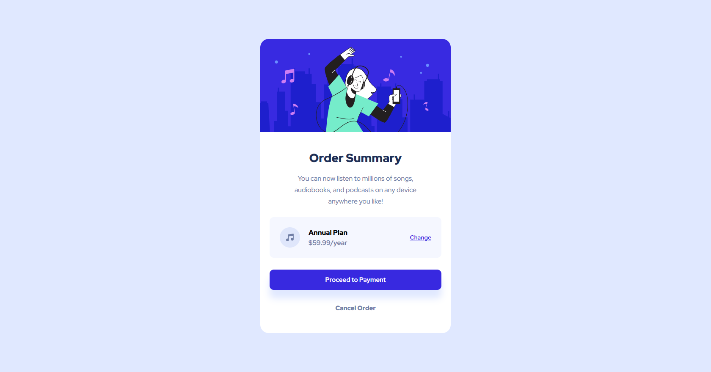

# Frontend Mentor - Order summary card solution

This is a solution to the [Order summary card challenge on Frontend Mentor](https://www.frontendmentor.io/challenges/order-summary-component-QlPmajDUj). Frontend Mentor challenges help you improve your coding skills by building realistic projects. 

## Screenshot

## Links

- [Solution page](https://www.frontendmentor.io/solutions/order-summary-component-aVP9o92SvL)
- [Live site](https://risaysky.github.io/Frontend-Mentor-Order-summary-component/)

### Built with

- Semantic HTML5 markup
- CSS custom properties
- Flexbox
- CSS Grid
- Mobile-first workflow
